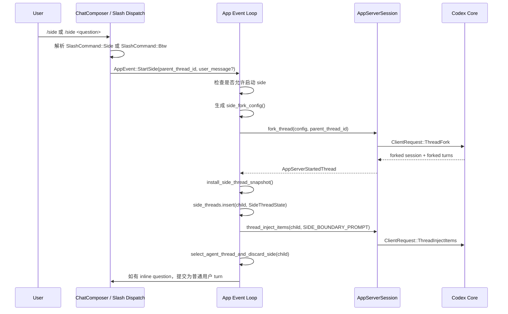

# Codex CLI `/side` 侧边对话实现原理

> 验证范围：本文只基于 OpenAI 官方 `openai/codex` 开源仓库、官方 Codex CLI 文档、以及对应 PR 说明整理。官方公开源码能直接确认的是 Codex TUI/CLI 的 `/side` 实现；官方文档同时说明该能力用于 CLI/IDE extension。本文不等同于 Codex App 侧边对话的完整 UX 实现，也不讨论任何宿主产品的复刻方案。

## 结论

Codex 的侧边对话不是一个普通聊天框，也不是一个“问一次就返回答案”的旁路 API。它是一个临时线程机制：

1. 从当前主线程 fork 出一个 side thread。
2. side thread 继承父线程历史，供模型参考。
3. 系统向 side thread 注入隐藏边界消息，要求模型只把 fork 前历史当参考，不继续执行父线程任务。
4. side thread 使用 `ephemeral = true` 配置，强调临时性。
5. UI 进入 side 模式，同时持续显示父线程状态。
6. 用户返回父线程时，Codex 会 interrupt、unsubscribe，并丢弃 side thread 的本地状态。

一句话：`/side` = thread fork + ephemeral config + hidden boundary prompt + side UI state + cleanup lifecycle。

## 与 Codex App 体验的边界

Codex CLI/TUI 的 `/side` 和 Codex App 的侧边对话在用户体验上不一定完全一致。本文能从开源源码确认的是 CLI/TUI 的机制：打开时 fork 当前 thread、注入 boundary prompt、side thread 临时存在、返回时清理。

Codex App 的侧边对话可能在 UI 容器复用、面板保留、线程展示、返回方式、历史可见性、以及和主会话的同步体验上做了额外产品层处理。除非有 Codex App 对应源码或通过可重复行为测试验证，否则不能把 CLI/TUI 的实现细节直接当作 Codex App 的完整实现。

## 官方依据

| 来源 | 位置 | 说明 |
| --- | --- | --- |
| Codex CLI 文档 | <https://developers.openai.com/codex/cli/slash-commands> | `/side` 用于从当前 conversation 启动 ephemeral fork，side transcript 与 parent 分离。 |
| `/side` PR | <https://github.com/openai/codex/pull/18190> | 说明该能力用于 quick side questions，避免打断主流程；一次只允许一个 side conversation。 |
| `side.rs` | <https://github.com/openai/codex/blob/main/codex-rs/tui/src/app/side.rs> | 侧边线程生命周期主实现：fork、边界 prompt、UI 同步、返回、丢弃。 |
| `slash_dispatch.rs` | <https://github.com/openai/codex/blob/main/codex-rs/tui/src/chatwidget/slash_dispatch.rs> | slash command 分发：把 `/side` 转成 `AppEvent::StartSide`。 |
| `slash_command.rs` | <https://github.com/openai/codex/blob/main/codex-rs/tui/src/slash_command.rs> | 命令定义：`Side`、`Btw`、inline args、side mode 下允许的命令。 |
| `app_event.rs` | <https://github.com/openai/codex/blob/main/codex-rs/tui/src/app_event.rs> | `AppEvent::StartSide` 事件定义。 |
| `app_server_session.rs` | <https://github.com/openai/codex/blob/main/codex-rs/tui/src/app_server_session.rs> | app-server 请求封装：`ThreadFork`、`ThreadInjectItems`、`ThreadUnsubscribe`、`turn/interrupt`。 |

## 核心对象

| 对象 | 所在文件 | 作用 |
| --- | --- | --- |
| `SlashCommand::Side` | `slash_command.rs` | `/side` 命令本体。 |
| `SlashCommand::Btw` | `slash_command.rs` | `/side` 的兼容别名。 |
| `AppEvent::StartSide` | `app_event.rs` | 从 UI 命令层传到 app 层的事件。 |
| `SideThreadState` | `side.rs` | 记录 side thread 的 parent thread，以及 parent 当前状态。 |
| `SideParentStatus` | `side.rs` | 把父线程状态映射成 UI 标签：需要输入、需要审批、失败、中断、关闭、完成。 |
| `SIDE_BOUNDARY_PROMPT` | `side.rs` | 注入 side thread 的隐藏边界消息。 |
| `SIDE_DEVELOPER_INSTRUCTIONS` | `side.rs` | 追加到 fork config 的 side 模式开发者指令。 |
| `AppServerSession::fork_thread` | `app_server_session.rs` | 发起 `ThreadFork` 请求。 |
| `AppServerSession::thread_inject_items` | `app_server_session.rs` | 向 side thread 注入隐藏边界消息。 |
| `AppServerSession::thread_unsubscribe` | `app_server_session.rs` | 关闭 side thread 订阅。 |

## 用户入口

Codex 暴露两个命令：

| 命令 | 作用 |
| --- | --- |
| `/side` | 打开一个空的 side conversation。 |
| `/side <question>` | 打开 side conversation，并立刻把 `<question>` 作为用户消息提交。 |
| `/btw` | `/side` 的兼容别名。 |
| `/btw <question>` | `/side <question>` 的兼容别名。 |

`slash_command.rs` 里有三类关键定义：

1. `SlashCommand` enum 包含 `Side` 和 `Btw`。
2. 命令描述是启动一个 ephemeral fork。
3. `supports_inline_args()` 明确允许 `/side <text>` 和 `/btw <text>`。

官方文档还说明：

1. `/side` 从当前 conversation 启动 ephemeral fork。
2. side transcript 与 parent thread 分离。
3. side mode 期间 UI 会继续显示 parent thread 状态。
4. `/side` 不能在另一个 side conversation 内使用。
5. `/side` 不能在 review mode 使用。

## 总体流程



## 入口分发

入口在 `chatwidget/slash_dispatch.rs`。

### 空 side conversation

当用户只输入 `/side` 或 `/btw`：

1. `dispatch_command()` 命中 `SlashCommand::Side` 或 `SlashCommand::Btw`。
2. `request_empty_side_conversation()` 读取当前 `thread_id`。
3. 如果当前 session 还没开始，直接报错。
4. 如果已有 `thread_id`，调用 `request_side_conversation(parent_thread_id, None)`。

### 带 inline question

当用户输入 `/side <question>` 或 `/btw <question>`：

1. `dispatch_command_with_args()` 命中 `SlashCommand::Side | SlashCommand::Btw`。
2. 将 inline args 转成 `UserMessage`。
3. 调用 `request_side_conversation(parent_thread_id, Some(user_message))`。

### 分发事件

`request_side_conversation()` 做三件事：

1. 设置临时 UI 标签：`Side starting...`。
2. 请求重绘。
3. 发送 `AppEvent::StartSide { parent_thread_id, user_message }`。

这里的设计重点是：slash command 层不直接 fork thread，只负责把用户意图转成 app event。真正的 side lifecycle 放在 `app/side.rs`。

## AppEvent

`app_event.rs` 中的 `AppEvent::StartSide` 是跨层事件：

```rust
StartSide {
    parent_thread_id: ThreadId,
    user_message: Option<UserMessage>,
}
```

它表达两个事实：

1. side conversation 必须有 parent thread。
2. inline question 是可选的；没有 inline question 时只打开 side thread。

## 启动前校验

启动逻辑在 `App::handle_start_side()`。

第一步调用 `side_start_block_message()` 判断是否允许启动：

| 条件 | 结果 |
| --- | --- |
| `primary_thread_id` 不存在 | `/side` 不可用，因为主线程还没 ready。 |
| 已经存在 side thread | 不允许再开一个；提示用户先返回。 |
| 其他情况 | 允许启动。 |

这说明 Codex 当前实现是单 side thread 模式：同一时刻只允许一个 side conversation。

如果启动被阻止，Codex 会把 inline question 恢复到 composer，避免用户输入丢失。

## Fork 配置

`side_fork_config()` 会基于当前 chat widget 的 config 克隆一份 fork config，然后做 side-specific 修改：

| 配置项 | 行为 |
| --- | --- |
| model | 继承当前 UI 选中的 model。 |
| reasoning effort | 继承当前 reasoning effort。 |
| service tier | 继承当前 service tier。 |
| ephemeral | 设置为 `true`。 |
| developer instructions | 追加 side 模式专用 developer instructions。 |

`ephemeral = true` 是核心标记：side conversation 被设计成临时 fork，而不是普通长期 thread。

## 隐藏 guardrail

Codex 同时用了两层 guardrail：

1. `SIDE_DEVELOPER_INSTRUCTIONS`
2. `SIDE_BOUNDARY_PROMPT`

### `SIDE_DEVELOPER_INSTRUCTIONS`

这段指令追加在 fork config 的 developer instructions 后面。它定义 side conversation 的身份和边界：

1. 当前线程是 side conversation，不是 main thread。
2. 继承的 fork history 只作为参考材料。
3. 不要把继承历史里的计划、请求、审批、工具调用当成当前任务。
4. 只处理 side boundary 之后的用户指令。
5. 可以做非修改性的检查和探索。
6. 不要修改文件、源码、git 状态、权限、配置或 workspace 状态，除非用户在 side conversation 里明确要求。
7. 不要主动请求更高权限，除非 side conversation 里明确要求的变更需要它。

### `SIDE_BOUNDARY_PROMPT`

`side_boundary_prompt_item()` 会构造一个 `ResponseItem::Message`：

| 字段 | 值 |
| --- | --- |
| `role` | `user` |
| `content` | `SIDE_BOUNDARY_PROMPT` |
| `phase` | `None` |

虽然它是 user role message，但它用于系统内部注入，不是用户在 UI 里手动输入的消息。

边界 prompt 的作用：

1. 明确告诉模型：边界之前是 parent thread 继承历史。
2. 边界之前的内容只作参考，不是当前任务。
3. 不要继续、执行、完成边界前的任务、计划、工具调用、审批、编辑或请求。
4. 只有边界之后提交的消息才是当前 side conversation 的有效用户指令。
5. side assistant 应轻量回答问题或做非修改性探索。
6. 不应修改 workspace 状态，除非用户在边界之后明确要求。

这层设计解决的是 fork 最大的风险：fork 会继承上下文，但不能让模型误以为自己要继续父线程正在执行的任务。

## Fork 执行

`handle_start_side()` 的主流程：

1. 记录 telemetry：`codex.thread.side`。
2. 刷新内存中的配置。
3. 调用 `side_fork_config()` 生成 fork config。
4. 调用 `app_server.fork_thread(fork_config, parent_thread_id)`。
5. 从返回结果中取得 `child_thread_id`。
6. 为 child thread 建立 event channel。
7. 调用 `install_side_thread_snapshot()` 安装本地 snapshot。
8. 将 `child_thread_id` 写入 `side_threads`。
9. 调用 `thread_inject_items(child_thread_id, [side_boundary_prompt_item()])`。
10. 切换 UI 到 child thread。
11. 如果用户输入了 `/side <question>`，把 `<question>` 作为普通用户 turn 提交。

这里有两个细节很关键。

### 视觉历史和模型历史分离

`install_side_thread_snapshot()` 的注释明确说明：

1. forked history 仍通过 core state 对模型可用。
2. side conversation 在 UI 上应该从 side boundary 处开始显示。

因此，模型能参考父线程历史，但用户看到的是一条新的 side transcript。

### boundary prompt 失败会回滚

如果 `thread_inject_items()` 失败：

1. Codex 会尝试丢弃 side thread。
2. 恢复用户 inline question 到 composer。
3. 显示错误。
4. 不会让一个没有 boundary guardrail 的 side thread 继续运行。

这说明 boundary prompt 不是装饰，而是 side conversation 成立的必要条件。

## AppServerSession 请求

`app_server_session.rs` 封装了 side conversation 需要的底层请求。

### `fork_thread()`

`fork_thread(config, thread_id)` 会：

1. 生成 request id。
2. 将 config 转成 session config。
3. 发出 `ClientRequest::ThreadFork`。
4. 带上 parent `thread_id`。
5. 返回 `AppServerStartedThread`，其中包含 forked session 和 turns。

### `thread_inject_items()`

`thread_inject_items(thread_id, items)` 会：

1. 把 `ResponseItem` 序列化成 JSON。
2. 发出 `ClientRequest::ThreadInjectItems`。
3. 将 items 注入指定 thread。

在 `/side` 里，注入的 item 就是 `SIDE_BOUNDARY_PROMPT`。

### `thread_unsubscribe()`

返回或关闭 side conversation 时，Codex 会调用 `thread_unsubscribe(thread_id)` 取消订阅 side thread。

### `turn_interrupt()` / `startup_interrupt()`

如果 side thread 正在运行 turn，Codex 会先 interrupt：

1. 有 active turn id 时调用 `turn_interrupt(thread_id, turn_id)`。
2. 没有 active turn id 时调用 `startup_interrupt(thread_id)`。

这可以避免用户返回主线程后，side thread 还在后台继续占用资源或继续发事件。

## UI 状态

side UI 状态集中在 `sync_side_thread_ui()`。

当当前 active thread 不是 side thread：

1. 清空 side label。
2. 关闭 side active 状态。
3. 解除 rename block。
4. 恢复默认 interrupted-turn notice。

当当前 active thread 是 side thread：

1. 禁止重命名：side conversation 是 ephemeral，不能 rename。
2. 设置 side active 状态。
3. suppress interrupted-turn notice，避免 side 模式下主线程提示干扰。
4. 生成 context label。

label 会包含：

1. 来源：from main thread 或 from parent thread。
2. 父线程状态：例如 needs input、needs approval、failed、interrupted、closed、finished。
3. 返回提示：Ctrl+C to return。

## 父线程状态跟踪

`SideParentStatus` 把 parent thread 的 server request / notification 映射成 UI 状态。

| 状态 | 含义 |
| --- | --- |
| `NeedsInput` | 父线程正在等待用户输入。 |
| `NeedsApproval` | 父线程正在等待审批，例如命令执行、文件变更、权限请求、patch 请求。 |
| `Failed` | 父线程 turn 失败。 |
| `Interrupted` | 父线程被中断。 |
| `Closed` | 父线程关闭。 |
| `Finished` | 父线程完成。 |

`NeedsInput` 和 `NeedsApproval` 被视为 actionable status。相关 request resolved 后，Codex 会清掉这些 actionable 状态。

这就是用户在 side conversation 里仍能知道主线程是否需要处理的原因。

## 返回与丢弃

返回逻辑主要由 `maybe_return_from_side()` 和 `select_agent_thread_and_discard_side()` 处理。

### 自动返回条件

`maybe_return_from_side()` 只有在以下条件都满足时才返回：

1. 没有 overlay。
2. 没有 modal 或 popup。
3. composer 为空。
4. 当前 active thread 是 side thread。
5. 找得到 parent thread。

满足后，Codex 选择 parent thread，并丢弃 side thread。

### 切换时丢弃

`side_thread_to_discard_after_switch(target_thread_id)` 判断当前 active thread 是否是 side thread：

1. 如果目标就是当前 side thread，不丢弃。
2. 如果当前不是 side thread，不丢弃。
3. 如果从 side thread 切到别的 thread，返回当前 side thread id，准备丢弃。

`select_agent_thread_and_discard_side()` 会先切换到目标 thread，再尝试丢弃原 side thread。

### 丢弃流程

`discard_side_thread()` 做三件事：

1. `interrupt_side_thread()`：中断 side thread 的 active turn 或 startup。
2. `thread_unsubscribe()`：取消 app-server 订阅。
3. `discard_thread_local_state()`：删除本地状态。

本地状态清理包括：

1. abort thread event listener。
2. 删除 `thread_event_channels`。
3. 从 `side_threads` 删除。
4. 从 `agent_navigation` 删除。
5. 如果 active thread 正是该 side thread，则清空 active thread。
6. 刷新 pending approvals。
7. 同步 active agent label。

如果清理失败，Codex 会尽量把 side thread 保持可见，避免用户以为它已经关闭但后台仍在运行。

## Side mode 下的 slash command 限制

`slash_command.rs` 定义了 `available_in_side_conversation()`。

side mode 里只允许以下命令：

| 命令 | 原因 |
| --- | --- |
| `/copy` | 复制内容，不改变任务状态。 |
| `/raw` | 切换/查看原始输出相关能力。 |
| `/diff` | 查看 diff，偏只读。 |
| `/mention` | 引用上下文。 |
| `/status` | 查看状态。 |
| `/ide` | IDE 相关安全命令。 |

其他 slash command 在 side mode 中会被拦截，并提示用户先返回主线程。

这个限制配合 boundary prompt，避免 side conversation 误触会影响主线程或全局状态的操作。

## 异常处理

Codex 对 side conversation 的异常处理比较克制，核心原则是：用户输入不能丢，未完成 guardrail 的 side thread 不能留下。

| 场景 | 处理 |
| --- | --- |
| 主线程未 ready | 拒绝 `/side`，提示当前不可用。 |
| 当前 conversation 还没开始 | 拒绝 `/side`，提示先发一条消息。 |
| 已经有 side thread | 拒绝新建，提示先返回。 |
| `ThreadFork` 失败 | 恢复 inline question，清空 side label，展示错误。 |
| boundary prompt 注入失败 | 丢弃 child thread，恢复 inline question，展示错误。 |
| 切换到 child thread 失败 | 丢弃 child thread，尝试恢复 parent thread，恢复 inline question。 |
| 关闭 side thread 失败 | 保持 side thread 可见，避免后台残留不可见任务。 |

## 测试覆盖点

`side.rs` 中已有直接针对 side guardrail 的测试，重点确认：

1. `side_boundary_prompt_item()` 生成的是 user role message。
2. boundary prompt 包含“继承历史只作参考”的语义。
3. boundary prompt 包含“不是当前任务”的语义。
4. boundary prompt 包含“边界之后的消息才是 active instruction”的语义。
5. boundary prompt 包含“不要继续或执行边界前任务”的语义。
6. boundary prompt 包含“独立于 main thread”的语义。
7. boundary prompt 包含“不要修改文件”的语义。
8. `side_start_error_message()` 能把特定 fork 前置条件错误转成用户可理解提示。
9. `side_developer_instructions()` 会保留已有 developer policy，并追加 side policy。

这些测试说明官方实现把 side boundary 当成核心安全约束，而不是 UI 文案。

## 关键设计判断

### 1. Side conversation 是 thread 级能力

`/side` 不只是从 UI 开一个 panel。真正动作发生在 `ThreadFork`。这让 side conversation 天然继承父线程上下文、工具配置和运行环境。

### 2. Fork 之后必须立刻注入 boundary

fork 会继承历史。如果不插入 boundary，模型可能继续执行父线程任务。Codex 用 hidden developer instructions 和 hidden boundary prompt 双层约束来阻断这种任务连续性。

### 3. UI 历史和模型上下文是分开的

模型可以看见 forked history，用户 UI 只从 side boundary 后开始显示。这让 side conversation 既“懂上下文”，又不会把主线程 transcript 原样塞进 side 视图。

### 4. Side thread 是临时的

`ephemeral = true`、禁止 rename、返回时 discard、unsubscribe，说明它不是普通历史线程。

### 5. 同时只允许一个 side conversation

官方 PR 和源码都体现了这个限制。这样可以避免多个 side fork 同时存在时，父子状态、返回路径、后台任务和审批提示变复杂。

### 6. 侧边模式默认非修改

side guardrail 并不是完全禁止修改，而是要求用户必须在 side boundary 之后明确请求修改。没有明确请求时，side conversation 应只回答问题或做轻量、非修改性探索。

## 最小状态机

```text
Idle
  |
  | /side
  v
Starting
  |
  | ThreadFork success
  v
Forked
  |
  | ThreadInjectItems success
  v
ActiveSide
  |
  | Ctrl+C / return / switch away
  v
Discarding
  |
  | interrupt + unsubscribe + local cleanup
  v
Idle
```

失败路径：

```text
Starting -- fork failed --> Idle + restore user message
Forked -- inject failed --> Discarding + restore user message
ActiveSide -- cleanup failed --> ActiveSide remains visible
```

## 调用链速查

```text
User input
  -> ChatComposer parses slash command
  -> ChatWidget::handle_slash_command_dispatch()
  -> ChatWidget::dispatch_command()
  -> ChatWidget::request_empty_side_conversation()
  -> ChatWidget::request_side_conversation()
  -> AppEvent::StartSide
  -> App::handle_start_side()
  -> App::side_fork_config()
  -> AppServerSession::fork_thread()
  -> ClientRequest::ThreadFork
  -> App::install_side_thread_snapshot()
  -> AppServerSession::thread_inject_items()
  -> ClientRequest::ThreadInjectItems
  -> App::select_agent_thread_and_discard_side()
  -> ChatWidget::submit_user_message_as_plain_user_turn() when inline question exists
```

关闭链路：

```text
Ctrl+C / return / switch away
  -> App::maybe_return_from_side()
  -> App::select_agent_thread_and_discard_side(parent)
  -> App::discard_side_thread()
  -> App::interrupt_side_thread()
  -> AppServerSession::turn_interrupt() or startup_interrupt()
  -> AppServerSession::thread_unsubscribe()
  -> App::discard_thread_local_state()
```

## 术语表

| 术语 | 含义 |
| --- | --- |
| Parent thread | side conversation fork 的来源线程。 |
| Primary thread | 当前主线程；parent thread 通常就是 primary thread。 |
| Side thread | 从 parent fork 出来的临时线程。 |
| Forked history | fork 时继承的父线程历史；模型可参考，UI 不直接显示。 |
| Boundary prompt | 注入 side thread 的隐藏 user message，用来划分“继承历史”和“当前 side 指令”。 |
| Developer instructions | fork config 里的开发者指令；side 模式会追加 guardrail。 |
| Ephemeral | 临时线程标记；配合禁止 rename、返回即丢弃等行为。 |
| Actionable parent status | 父线程需要输入或审批，side UI 需要提示用户。 |

## 文件级阅读顺序

建议按这个顺序读官方源码：

1. `codex-rs/tui/src/slash_command.rs`
   - 先看 `Side` / `Btw` 的命令定义、描述、inline args、side mode 可用命令。
2. `codex-rs/tui/src/chatwidget/slash_dispatch.rs`
   - 看 `/side` 如何变成 `AppEvent::StartSide`。
3. `codex-rs/tui/src/app_event.rs`
   - 看 `StartSide` 事件结构。
4. `codex-rs/tui/src/app/side.rs`
   - 看 side lifecycle 主体：guardrail、fork config、启动、UI 同步、父状态、返回和丢弃。
5. `codex-rs/tui/src/app_server_session.rs`
   - 看 `ThreadFork`、`ThreadInjectItems`、`ThreadUnsubscribe`、`turn/interrupt` 请求封装。

## 一句话复盘

Codex 的 `/side` 是一个受保护的临时 thread fork：它继承父线程上下文，但用隐藏 developer instructions 和 boundary prompt 把继承历史降级成参考材料；UI 进入 side 模式并显示父线程状态；退出时中断、退订并清理 side thread，从而让用户可以临时提问而不污染主任务。
